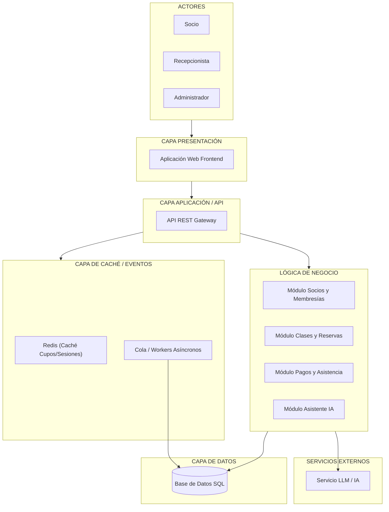

# Arquitectura Inicial del Sistema de Gimnasio

## Diagrama de Arquitectura

## Descripción
La arquitectura inicial está diseñada con una estructura en capas escalable que responde a los requerimientos del proyecto:
- **Capa de Presentación:** Interfaz web interactiva para Socios, Recepcionistas y Administradores.
- **Capa de Aplicación y Caché:** La API REST responde a solicitudes y utiliza **Redis** para mantener en caché la información de clases y disponibilidad de cupos, reduciendo la carga en la BD. Además, utiliza procesos asíncronos para evitar bloqueos (*No Waitpoint*).
- **Lógica de Negocio:** Organizada en módulos independientes (Socios, Clases, Pagos y el Asistente IA).
- **Servicios Externos y Datos:** Integración con servicios de Inteligencia Artificial y persistencia en Base de Datos SQL.